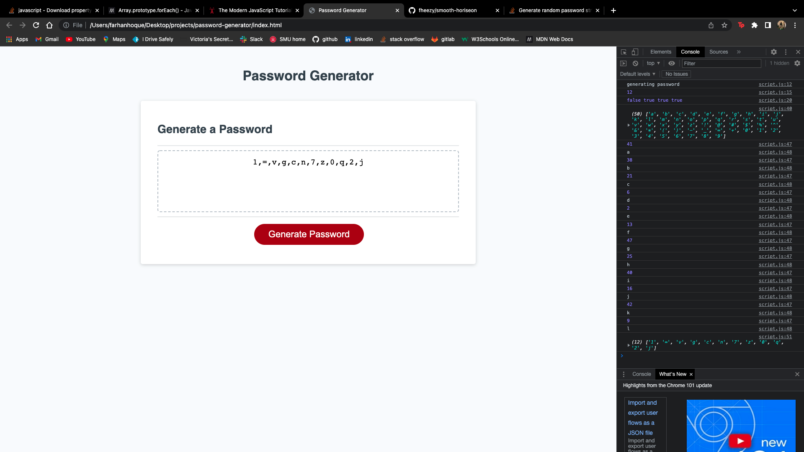

# password-generator

## Description: 
As an employee it is ideal to have a secured password for senestive data so whats better than having a password generator. I cloned my starter code to create this password generator, i worked on my javascript file including multplie variables along with functions as well with adding strigns, i encountered some difficulties on my java file. Struggled with creating a variable for a radnom index, troubled with an epmty array and from all i had trouubles with my if statements however, it was situated out and the code should be cleaned up as well as being functional. I also added comments/notes on the java file leaving them there for the next developer to understand what i did, i can say during this project i was able to practice more with my if statemenents and arrays. 

## Table of Contacts

## Installation
Refactor the code from git, coppied the the html and uploaded it in VS code, edited the JS script, i also added two more files; mockup and license. Looked on the browser and tested out the password generator, also sectioned off to ther right "inspect" being able to detect any issues along the console tab. Next i left comments, i used terminal to commit, used git to push orgiin main, git status, added to git. 

## Usage

## Credits 
[SMU boot camp instructor] http://www.smu.edu

## License 
Licensed under the [MIT License](LICENSE)
